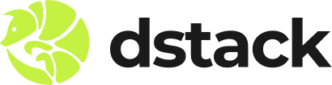

<div align="center">



### Deploy confidential workloads on GCP and AWS.

[](https://github.com/Phala-Network/dstack-cloud/stargazers)
[](https://github.com/Phala-Network/dstack-cloud/blob/master/LICENSE)
[](https://api.reuse.software/info/github.com/Phala-Network/dstack-cloud)
[](https://deepwiki.com/Dstack-TEE/dstack)
[](https://t.me/+UO4bS4jflr45YmUx)

[Documentation](https://docs.phala.com/dstack) · [Examples](https://github.com/Dstack-TEE/dstack-examples) · [Community](https://t.me/+UO4bS4jflr45YmUx)

</div>

---

## What is dstack-cloud?

dstack-cloud extends [dstack](https://github.com/Dstack-TEE/dstack) to deploy containers on **GCP Confidential VMs** and **AWS Nitro Enclaves**. It provisions the VM, manages attestation, and handles networking. You get confidential computing on cloud infrastructure without running your own TDX hardware.

Your containers run with full security infrastructure out of the box: key management, remote attestation, hardened OS, and encrypted storage. Users can cryptographically verify exactly what's running.

## Supported Platforms

| Platform | Status | Attestation |
|----------|--------|-------------|
| **[Phala Cloud](https://cloud.phala.network)** | Available | TDX |
| **GCP Confidential VMs** | Available | TDX + TPM |
| **AWS Nitro Enclaves** | Available | NSM |
| **Bare metal TDX** | Available | TDX |

## Quick Start

**1. Create a project:**

```bash
dstack-cloud new my-app
cd my-app
```

**2. Edit your docker-compose.yaml:**

```yaml
services:
  vllm:
    image: vllm/vllm-openai:latest
    runtime: nvidia
    command: --model Qwen/Qwen2.5-7B-Instruct
    ports:
      - "8000:8000"
```

**3. Deploy:**

```bash
dstack-cloud deploy
```

**4. Check status:**

```bash
dstack-cloud status
dstack-cloud logs --follow
```

For the full walkthrough, see the [Quickstart Guide](./docs/quickstart.md).

## Features

**Zero friction onboarding**
- **Docker Compose native**: Bring your docker-compose.yaml as-is. No SDK, no code changes.
- **Encrypted by default**: Network traffic and disk storage encrypted out of the box.

**Hardware-rooted security**
- **Private by hardware**: Data encrypted in memory, inaccessible even to the host.
- **Reproducible OS**: Deterministic builds mean anyone can verify the OS image hash.
- **Workload identity**: Every app gets an attested identity users can verify cryptographically.
- **Confidential GPUs**: Native support for NVIDIA Confidential Computing (H100, Blackwell).

**Trustless operations**
- **Isolated keys**: Per-app keys derived in TEE. Survives hardware failure. Never exposed to operators.
- **Code governance**: Updates follow predefined rules (e.g., multi-party approval). Operators can't swap code or access secrets.

## Architecture


Your container runs inside a Confidential VM (Intel TDX on GCP, Nitro Enclave on AWS). GPU isolation is optional via NVIDIA Confidential Computing. The CPU TEE protects application logic. The GPU TEE protects model weights and inference data.

**Core components:**

- **Guest Agent**: Runs inside each CVM. Generates attestation quotes so users can verify exactly what's running. Provisions per-app cryptographic keys from KMS. Encrypts local storage. Apps interact via `/var/run/dstack.sock`.

- **KMS**: Runs in its own TEE. Verifies attestation quotes before releasing keys. Enforces authorization policies that operators cannot bypass. Derives deterministic keys bound to each app's attested identity.

- **Gateway**: Terminates TLS at the edge. Provisions ACME certificates automatically. Routes traffic to CVMs. Internal communication uses RA-TLS for mutual attestation.

- **VMM**: Parses docker-compose files directly — no app changes needed. Boots CVMs from a reproducible OS image. Allocates CPU, memory, and confidential GPU resources.

[Full security model →](./docs/security/security-model.md)

## CLI Reference

```
dstack-cloud new <name>              # Create a new project
dstack-cloud config-edit             # Edit global configuration
dstack-cloud deploy                  # Deploy to cloud
dstack-cloud status                  # Check deployment status
dstack-cloud logs [--follow]         # View console logs
dstack-cloud stop                    # Stop the VM
dstack-cloud start                   # Start a stopped VM
dstack-cloud remove                  # Remove the VM and cleanup
dstack-cloud list                    # List all deployments
dstack-cloud fw allow <port>         # Allow traffic on a port
dstack-cloud fw deny <port>          # Block traffic on a port
dstack-cloud fw list                 # List firewall rules
```

## SDKs

Apps communicate with the guest agent via HTTP over `/var/run/dstack.sock`. Use the [HTTP API](https://github.com/Dstack-TEE/dstack/blob/master/sdk/curl/api.md) directly with curl, or use a language SDK:

| Language | Install | Docs |
|----------|---------|------|
| Python | `pip install dstack-sdk` | [README](https://github.com/Dstack-TEE/dstack/blob/master/sdk/python/README.md) |
| TypeScript | `npm install @phala/dstack-sdk` | [README](https://github.com/Dstack-TEE/dstack/blob/master/sdk/js/README.md) |
| Rust | `cargo add dstack-sdk` | [README](https://github.com/Dstack-TEE/dstack/blob/master/sdk/rust/README.md) |
| Go | `go get github.com/Dstack-TEE/dstack/sdk/go` | [README](https://github.com/Dstack-TEE/dstack/blob/master/sdk/go/README.md) |

## Documentation

**Getting Started**
- [Quickstart](./docs/quickstart.md) - Deploy your first app on GCP or AWS
- [Usage Guide](./docs/usage.md) - Deploying and managing apps
- [Verification](./docs/verification.md) - How to verify TEE attestation

**Cloud Platforms**
- [GCP Attestation](./docs/attestation-gcp.md) - TDX + TPM attestation on GCP
- [AWS Nitro Attestation](./docs/attestation-nitro-enclave.md) - NSM attestation on AWS

**For Developers**
- [Confidential AI](./docs/confidential-ai.md) - Inference, agents, and training with hardware privacy
- [App Compose Format](./docs/normalized-app-compose.md) - Compose file specification

**Self-Hosted / Bare Metal**
- [Deployment](./docs/deployment.md) - Self-hosting on TDX hardware
- [VMM CLI Guide](./docs/vmm-cli-user-guide.md) - VMM command-line reference
- [Gateway](./docs/dstack-gateway.md) - Gateway configuration
- [On-Chain Governance](./docs/onchain-governance.md) - Policy-based authorization

**Reference**
- [Design Decisions](./docs/design-and-hardening-decisions.md) - Architecture rationale
- [FAQ](./docs/faq.md) - Frequently asked questions

## Security

- [Security Overview](./docs/security/) - Security documentation and responsible disclosure
- [Security Model](./docs/security/security-model.md) - Threat model and trust boundaries
- [Security Best Practices](./docs/security/security-best-practices.md) - Production hardening
- [Security Audit](./docs/security/dstack-audit.pdf) - Third-party audit by zkSecurity
- [CVM Boundaries](./docs/security/cvm-boundaries.md) - Information exchange and isolation

## FAQ

<details>
<summary><strong>Why not use AWS Nitro / Azure Confidential VMs / GCP directly?</strong></summary>

You can — but you'll build everything yourself: attestation verification, key management, Docker orchestration, certificate provisioning, and governance. dstack-cloud provides all of this out of the box.

| Approach | Docker native | GPU TEE | Key management | Attestation tooling | Open source |
|----------|:-------------:|:-------:|:--------------:|:-------------------:|:-----------:|
| **dstack-cloud** | ✓ | ✓ | ✓ | ✓ | ✓ |
| AWS Nitro Enclaves | - | - | Manual | Manual | - |
| Azure Confidential VMs | - | Preview | Manual | Manual | - |
| GCP Confidential Computing | - | - | Manual | Manual | - |

Cloud providers give you the hardware primitive. dstack-cloud gives you the full stack: reproducible OS images, automatic attestation, per-app key derivation, and TLS certificates. No vendor lock-in.

</details>

<details>
<summary><strong>How is this different from SGX/Gramine?</strong></summary>

SGX requires porting applications to enclaves. dstack-cloud uses full-VM isolation (Intel TDX, AWS Nitro) — bring your Docker containers as-is. Plus GPU TEE support that SGX doesn't offer.

</details>

<details>
<summary><strong>What's the performance overhead?</strong></summary>

Minimal. Intel TDX adds ~2-5% overhead for CPU workloads. NVIDIA Confidential Computing has negligible impact on GPU inference. Memory encryption is the main cost, but it's hardware-accelerated on supported CPUs.

</details>

<details>
<summary><strong>Is this production-ready?</strong></summary>

Yes. dstack powers production AI at [OpenRouter](https://openrouter.ai/provider/phala) and [NEAR AI](https://x.com/ilblackdragon/status/1962920246148268235). It's been [audited by zkSecurity](./docs/security/dstack-audit.pdf). It's a Linux Foundation Confidential Computing Consortium project.

</details>

<details>
<summary><strong>Can I run this on my own hardware?</strong></summary>

Yes. dstack-cloud runs on any Intel TDX-capable server. See the [deployment guide](./docs/deployment.md) for self-hosting instructions. You can also use [Phala Cloud](https://cloud.phala.network) for managed infrastructure.

</details>

<details>
<summary><strong>What TEE hardware is supported?</strong></summary>

- **GCP**: Intel TDX (Confidential VMs)
- **AWS**: Nitro Enclaves (NSM attestation)
- **Bare metal**: Intel TDX (4th/5th Gen Xeon)
- **GPUs**: NVIDIA Confidential Computing (H100, Blackwell)

AMD SEV-SNP support is planned.

</details>

<details>
<summary><strong>How do users verify my deployment?</strong></summary>

Your app exposes attestation quotes via the SDK. Users verify these quotes using [dstack-verifier](https://github.com/Phala-Network/dstack-cloud/tree/master/verifier), [dcap-qvl](https://github.com/Phala-Network/dcap-qvl), or the [Trust Center](https://trust.phala.com). See the [verification guide](./docs/verification.md) for details.

</details>

## Trusted by

- [OpenRouter](https://openrouter.ai/provider/phala) - Confidential AI inference providers powered by dstack
- [NEAR AI](https://x.com/ilblackdragon/status/1962920246148268235) - Private AI infrastructure powered by dstack

dstack is a Linux Foundation [Confidential Computing Consortium](https://confidentialcomputing.io/2025/10/02/welcoming-phala-to-the-confidential-computing-consortium/) open source project.

## Community

[Telegram](https://t.me/+UO4bS4jflr45YmUx) · [GitHub Discussions](https://github.com/Dstack-TEE/dstack/discussions) · [Examples](https://github.com/Dstack-TEE/dstack-examples)

For enterprise support and licensing, [book a call](https://cal.com/team/phala/founders) or email us at support@phala.network.

[](https://github.com/Dstack-TEE/dstack/pulse)

## Cite

If you use dstack in your research, please cite:

```bibtex
@article{zhou2025dstack,
  title={Dstack: A Zero Trust Framework for Confidential Containers},
  author={Zhou, Shunfan and Wang, Kevin and Yin, Hang},
  journal={arXiv preprint arXiv:2509.11555},
  year={2025}
}
```

## Media Kit

Logo and branding assets: [dstack-logo-kit](./docs/assets/dstack-logo-kit/)

## License

This repository is licensed under the Business Source License 1.1 (BUSL-1.1). Per the terms in [LICENSE](./LICENSE), the Licensed Work is `dstack-cloud`.

BUSL-1.1 permits copying, modification, redistribution, and **non-production** use. Production use requires a commercial license. [Book a call](https://cal.com/team/phala/founders) or email support@phala.network.
