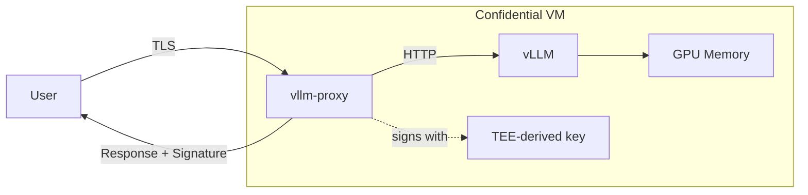
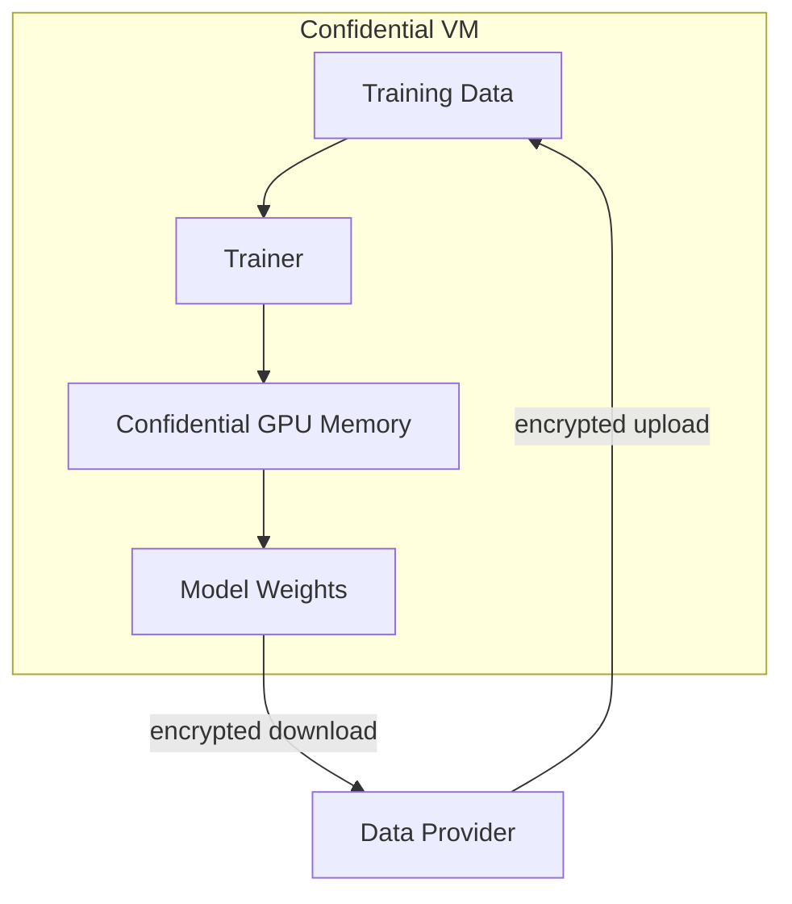
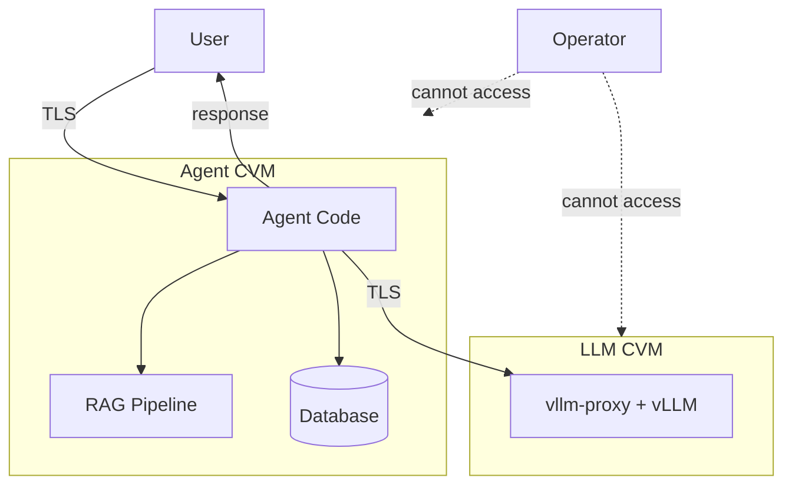
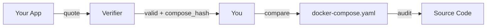

# Confidential AI

Run AI workloads where the infrastructure operator can't see your data. dstack uses Intel TDX and NVIDIA Confidential Computing to encrypt everything in memory—your prompts, model weights, and intermediate computations stay private.

## What You Can Build

- **Private inference** - Users verify their prompts never leave encrypted memory
- **Training on sensitive data** - Fine-tune models without exposing training data to operators
- **Trustworthy agents** - Prove your agent code can't exfiltrate user data

The key difference from self-hosting: users don't have to trust you. They can cryptographically verify what code runs and that the hardware is genuine.

## What Makes It Confidential

Four things need to be true for the system to be actually confidential:

**TLS terminates inside the VM.** Your HTTPS connection ends inside the Confidential VM, not at some load balancer outside. The operator never sees plaintext traffic.

**CPU memory is encrypted.** Intel TDX encrypts all RAM with hardware keys. The hypervisor can't read it, the host OS can't read it, even physical access to the DIMM won't help.

**GPU memory is encrypted.** On H100/H200/Blackwell with NVIDIA CC mode, GPU memory is encrypted too. Model weights and activations stay protected during inference and training.

**Disk is encrypted.** Anything written to storage uses keys derived from the TEE. The storage backend only sees ciphertext.

When all four are in place, data stays encrypted from network ingress to egress.

## Private Inference

Deploy vLLM behind a signing proxy. Users can verify responses came from your TEE, not a compromised server.

```yaml
services:
  vllm:
    image: vllm/vllm-openai:latest
    command: --model Qwen/Qwen2.5-7B-Instruct --host 0.0.0.0
    deploy:
      resources:
        reservations:
          devices:
            - driver: nvidia
              capabilities: [gpu]

  proxy:
    image: phalanetwork/vllm-proxy:latest
    ports:
      - "8000:8000"
    volumes:
      - /var/run/dstack.sock:/var/run/dstack.sock
    environment:
      - VLLM_BASE_URL=http://vllm:8000
      - MODEL_NAME=Qwen/Qwen2.5-7B-Instruct
      - TOKEN=${TOKEN}
```

The data flow looks like this:



The proxy terminates TLS, forwards to vLLM, and signs responses with a key derived from the TEE's identity. That signature proves the response came from this specific environment.

Deploy it:

```bash
phala deploy -n my-llm -c docker-compose.yaml \
  --instance-type h200.small \
  -e TOKEN=your-secret
```

Verify a response signature:

```python
import requests

sig = requests.get(
    f"https://your-endpoint/v1/signature/{chat_id}",
    headers={"Authorization": "Bearer your-token"}
).json()

# sig contains signing_address, response_hash, signature
```

Try it live at [chat.redpill.ai](https://chat.redpill.ai). Full example: [dstack-examples/ai/inference](https://github.com/Dstack-TEE/dstack-examples/tree/main/ai/inference).

## Confidential Training

Fine-tune on sensitive data without exposing it to the operator. The training data and resulting weights stay in encrypted memory.

```yaml
services:
  trainer:
    image: unsloth/unsloth:latest
    command: python train.py --model meta-llama/Llama-3.2-3B --data /data/dataset.jsonl
    volumes:
      - /var/run/dstack.sock:/var/run/dstack.sock
      - training-data:/data
    environment:
      - HF_TOKEN=${HF_TOKEN}
      - WANDB_API_KEY=${WANDB_API_KEY}
    deploy:
      resources:
        reservations:
          devices:
            - driver: nvidia
              capabilities: [gpu]

volumes:
  training-data:
```

With NVIDIA CC on H100/H200, GPU memory is encrypted. Weights, gradients, and activations stay confidential throughout training.



Before a data provider shares sensitive data, they should:

1. Review your docker-compose.yaml—check for unexpected network access or volume mounts
2. Get the attestation quote and verify the compose hash matches
3. Confirm it's running on genuine TDX + NVIDIA CC hardware

The compose hash is a hash of your docker-compose.yaml. It's included in the attestation quote, so data providers can verify exactly what code will process their data.

```python
from dstack_sdk import DstackClient

client = DstackClient()
info = client.info()

print(f"Compose hash: {info.compose_hash}")
# Data provider compares this against the docker-compose they reviewed
```

Full example: [dstack-examples/ai/training](https://github.com/Dstack-TEE/dstack-examples/tree/main/ai/training).

## Trustworthy AI Agents

Agents do complex things with user data—RAG lookups, database queries, LLM calls. Users want guarantees: their data won't be logged, won't be used for training, won't be exfiltrated.

For true end-to-end privacy, the agent should call a confidential LLM endpoint (like the vllm-proxy from the inference section) instead of a third-party API. This keeps user prompts encrypted the entire way.

```yaml
services:
  agent:
    image: your-agent:latest
    volumes:
      - /var/run/dstack.sock:/var/run/dstack.sock
    environment:
      # Point to a confidential LLM endpoint, not OpenAI
      - LLM_BASE_URL=https://api.redpill.ai/v1
      - LLM_API_KEY=${LLM_API_KEY}
      - DATABASE_URL=${DATABASE_URL}
    ports:
      - "8080:8080"
```

The architecture looks like this:



Both the agent and the LLM run in separate TEEs. User queries stay encrypted from browser to agent to LLM and back. The operator sees nothing.

**Data stays private.** RAG retrievals, database queries, LLM calls, and agent state all run in encrypted memory. Using a confidential LLM means prompts never leave the encrypted environment.

**No hidden behavior.** The compose hash in the attestation proves what code is running. Users can audit the code and verify it matches—no secret logging, no unauthorized data collection.

**Provable constraints.** Want to prove your agent doesn't send user data to training pipelines? The auditable code + attestation makes that verifiable.

For agents that need persistent keys (signing, encryption), derive them from the TEE:

```python
from dstack_sdk import DstackClient

client = DstackClient()
key = client.get_key('agent/signing-key')
# Same deployment = same key, but key never leaves TEE
```

Full example: [dstack-examples/ai/agents](https://github.com/Dstack-TEE/dstack-examples/tree/main/ai/agents).

## Verification

Attestation proves the hardware is genuine and shows what code is running. But it doesn't automatically prove the code is safe—you need to audit it yourself.



The verification flow:

```python
import requests

# Get attestation with a nonce to prevent replay
attestation = requests.get(
    "https://your-app/attestation",
    params={"nonce": "random-challenge"}
).json()

# Compare compose hash against what you reviewed
expected_hash = "sha256:abc123..."  # From your audited docker-compose
assert attestation["compose_hash"] == expected_hash
```

For visual verification, paste the quote into [proof.t16z.com](https://proof.t16z.com), Phala's TEE attestation explorer that parses TDX quotes and displays the verification status, measurements, and TCB info in a readable format.

The compose hash only tells you *what* is running. You still need to verify that code does what you expect—no secret logging, no data exfiltration, proper access controls.

## Performance

GPU inference runs at 99% of bare-metal speed on H100/H200. The memory encryption happens in hardware, so the overhead is minimal. Larger models actually perform better in TEE—the encryption cost is fixed while compute scales with model size.

See the [full benchmark report](https://docs.phala.network/dstack/phala-cloud/references/performance-report) for CPU and storage numbers.

## Getting Started

1. Try [chat.redpill.ai](https://chat.redpill.ai) to see private inference in action
2. Deploy your own with the [inference example](https://github.com/Dstack-TEE/dstack-examples/tree/main/ai/inference)
3. Read the [Security Model](./security/security-model.md) for the full threat model

## Production

redpill.ai and NEAR AI run confidential AI on dstack in production.
